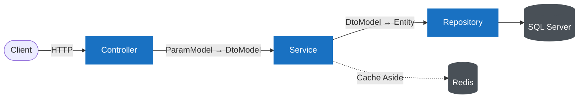
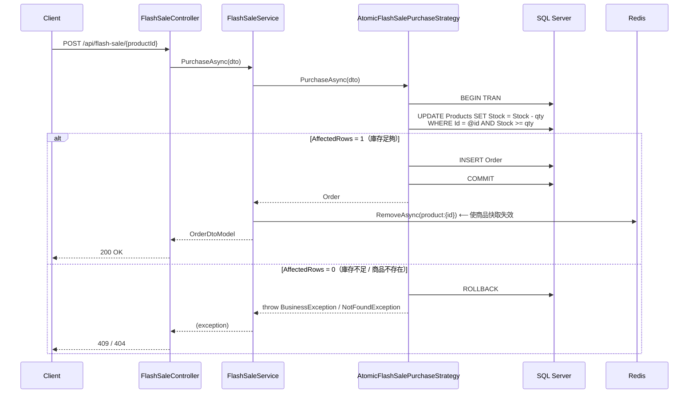
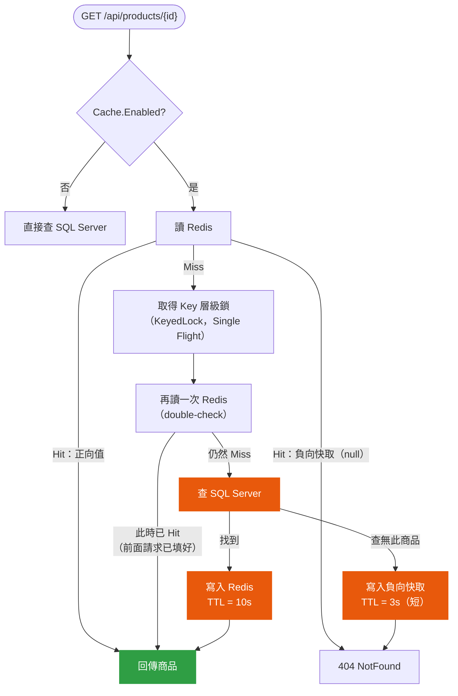

# High-Concurrency Flash Sale System

以 ASP.NET Core Web API 為主體的高併發學習專案。

學習原則：**先看到問題，再導入技術解決問題。**

完整規劃請見 [docs/計畫.md](docs/計畫.md)，架構規範請見
[docs/architecture/Backend_Architecture_Guideline.md](docs/architecture/Backend_Architecture_Guideline.md)。

---

## 目前進度

| Stage | Branch | 狀態 |
|---|---|---|
| 1. CRUD Baseline | `feature/crud` | ✅ 完成 |
| 2. Race Condition | `feature/race-condition` | ✅ 完成 — [結果](docs/load-test/race-condition.md) |
| 3. Concurrency Control | `feature/concurrency-control` | ✅ 完成 — [比較](docs/concurrency-comparison.md) |
| 4. Redis | `feature/redis` | ✅ 完成 — [結果](docs/load-test/redis.md) |
| 5. Message Queue | `feature/message-queue` | 未開始 |
| 6. Idempotency | `feature/idempotency` | 未開始 |
| 7. Rate Limit | `feature/rate-limit` | 未開始 |
| 8. Multi Instance | `feature/multi-instance` | 未開始 |
| 9. Load Test | `feature/load-test` | 未開始 |
| 10. Observability + Optimization | `feature/observability-optimization` | 未開始 |

---

## Stage 進度圖

```mermaid
flowchart LR
    S1["Stage 1<br/>CRUD Baseline"] --> S2["Stage 2<br/>Race Condition"]
    S2 --> S3["Stage 3<br/>Concurrency Control"]
    S3 --> S4["Stage 4<br/>Redis"]
    S4 --> S5["Stage 5<br/>Message Queue"]
    S5 --> S6["Stage 6<br/>Idempotency"]
    S6 --> S7["Stage 7<br/>Rate Limit"]
    S7 --> S8["Stage 8<br/>Multi Instance"]
    S8 --> S9["Stage 9<br/>Load Test"]
    S9 --> S10["Stage 10<br/>Observability"]

    classDef done fill:#2f9e44,stroke:#2f9e44,color:#fff
    classDef todo fill:#495057,stroke:#495057,color:#fff
    class S1,S2,S3,S4 done
    class S5,S6,S7,S8,S9,S10 todo
```



---

## Git 原則

本專案**只使用本地 Git**，不建立 GitHub Repository、不設定 remote、不執行 push。

```bash
git remote -v   # 預期沒有任何輸出
```

---

## 設定檔與機密

版控中**不存在任何真實連線字串或密碼**。

| 檔案 | 進版控 | 內容 |
|---|---|---|
| `src/FlashSale.Api/appsettings.json` | ✅ | 只有 Logging 等非機密設定 |
| `src/FlashSale.Api/appsettings.Development.Example.json` | ✅ | 範本，值全部是佔位字串 |
| `src/FlashSale.Api/appsettings.Development.json` | ❌ (`.gitignore`) | 本機真實連線資訊 |

第一次 clone 或換機器時：

```bash
cd src/FlashSale.Api
cp appsettings.Development.Example.json appsettings.Development.json
# 然後把 appsettings.Development.json 內的佔位值換成實際連線資訊
```

Example 檔已預留 `Redis` 與 `RabbitMq` 區塊，Stage 4 / Stage 5 會用到，
目前程式尚未讀取。

---

## 專案結構

```text
HighConcurrencyFlashSale/
│
├── src/FlashSale.Api/          # Controller → Service → Repository → Database
│   ├── Controllers/
│   ├── Services/  (+ Interfaces/)
│   ├── Repositories/  (+ Interfaces/)
│   ├── Models/  Entities / Dtos / Params / ViewModels
│   ├── Mappings/               # AutoMapper Profile
│   ├── Data/                   # AppDbContext / Configurations / Migrations
│   ├── Common/                 # Enums / Constants / Exceptions
│   ├── Infrastructure/         # Cache (Redis) / Diagnostics —— 外部 I/O
│   ├── Options/                # RedisOptions / CacheOptions
│   ├── Extensions/             # DependencyInjectionExtensions
│   ├── Middlewares/            # GlobalExceptionMiddleware
│   └── Program.cs
│
├── tests/
│   ├── FlashSale.UnitTests/
│   └── load/k6/                # k6 腳本與 PowerShell 執行器
├── docs/
└── docker-compose.yml          # redis（後續 Stage 會再加 rabbitmq / nginx）
```

計畫 §18 規劃的 `FlashSale.Application` / `Domain` / `Infrastructure` / `Worker`
專案尚未建立 —— 依計畫「目錄與 Infrastructure 應隨著 Stage 演進逐步加入」，
Stage 5 導入 RabbitMQ Consumer 時才會拆出 `FlashSale.Worker`。

### 三層式架構的資料流



Controller 只認 ParamModel / ViewModel，Service 承擔商業規則，
Repository 專責資料存取；Entity 絕不跨出 Repository/Service 邊界外流到 Client。

---

## 執行

### 前置

- .NET 9 SDK
- 可連線的 SQL Server
- 可連線的 Redis（`docker compose up -d redis` 可起一個本機的）
- k6（壓測用）：`winget install --id GrafanaLabs.k6`

### 建立資料庫

```bash
dotnet tool install --global dotnet-ef

$env:ASPNETCORE_ENVIRONMENT="Development"
dotnet ef database update --project src/FlashSale.Api/FlashSale.Api.csproj
```

### 啟動

```bash
$env:ASPNETCORE_ENVIRONMENT="Development"
dotnet run --project src/FlashSale.Api/FlashSale.Api.csproj --no-launch-profile --urls "http://localhost:5080"
```

Swagger UI：<http://localhost:5080/swagger>

### 測試

```bash
dotnet test
```

---

## API

Base URL：`http://localhost:5080`

### `GET /api/products`

取得所有商品。

```json
[
  { "id": 1, "name": "iPhone", "price": 30000.00, "stock": 10, "createdAt": "2026-08-28T03:21:18.675Z" }
]
```

### `GET /api/products/{id}`

單一商品。找不到回 `404`。

### `POST /api/products`

```json
{ "name": "iPhone", "price": 30000, "stock": 10 }
```

`201 Created`。名稱重複回 `409`。

### `PUT /api/products/{id}`

```json
{ "name": "iPhone 16", "price": 25000, "stock": 5 }
```

`200 OK`。找不到回 `404`。

### `POST /api/orders`

一般下單，**只建立訂單（`Pending`），不扣庫存**。

```json
{ "userId": 1, "productId": 1, "quantity": 1 }
```

`201 Created`。商品不存在回 `404`。

### `GET /api/orders?productId={id}` / `GET /api/orders/{id}`

查詢訂單。`productId` 版本用來驗證「送出 N 次 Request 後究竟建立了幾筆訂單」。

### `POST /api/flash-sale/{productId}`

搶購。**扣庫存 → 建立訂單（`Completed`）**，兩者在同一個交易內。

```json
{ "userId": 1, "quantity": 1, "strategy": "Atomic" }
```

| 狀況 | HTTP |
|---|---|
| 成功 | `200` + OrderViewModel |
| 商品不存在 | `404` |
| 庫存不足 | `409` |
| 樂觀鎖重試用盡 | `409` |

`strategy` 為選填，預設 `Atomic`（Stage 3 選定的主要方案）。
可選 `Baseline` / `Transaction` / `Optimistic` / `Atomic`，用於重跑 Stage 3 的比較。

> `Baseline` 是 Stage 1 的無保護版本，**會超賣**，僅作為對照組保留。

#### 搶購請求流程（以預設的 Atomic 為例）



檢查與扣減是**同一個 SQL 語句**，由資料庫的列鎖保證原子性，
應用程式完全不需要先讀取庫存 —— 這是它比 Transaction / Optimistic 兩版更快的原因。
只有成交後才清 Redis 快取，失敗（庫存不足）不清，見
[Stage 4 併發 §6](docs/load-test/redis.md#6-過程中發現並修正的問題)。

### `GET /api/diagnostics/metrics` / `POST /api/diagnostics/metrics/reset`

壓測用的觀測端點。回傳實際送到資料庫的命令數與快取命中率。

```json
{ "dbCommands": 1, "cacheHits": 4999, "cacheMisses": 42, "cacheErrors": 0, "cacheHitRate": 0.9917 }
```

`dbCommands` 由 EF Core Interceptor 累加，是實際值而非估算。

> 計數器存在單一 Instance 的記憶體中，Stage 8 導入多 Instance 後需要改寫。

### 錯誤格式

所有商業錯誤由 `GlobalExceptionMiddleware` 統一輸出：

```json
{ "status": 409, "message": "Insufficient stock.", "traceId": "0HNO4MDFJQUUN:00000001" }
```

| Exception | HTTP |
|---|---|
| `NotFoundException` | 404 |
| `BusinessException` | 409 |
| 其他 | 500 |

---

## Stage 1 驗證結果

計畫 §6「驗證」段落的手動測試，實際執行結果：

```text
建立商品                Stock = 10
依序送出 10 次搶購      10 × HTTP 200
第 11 次                HTTP 409  Insufficient stock.

最終 Stock              0
最終 Order 數量         10
```

符合預期。

### Baseline 的已知缺陷（Stage 3 起改為對照組保留）

[BaselineFlashSalePurchaseStrategy](src/FlashSale.Api/Services/FlashSaleStrategies/BaselineFlashSalePurchaseStrategy.cs)
使用一般 CRUD 思維：

```text
Read Product → Stock > 0 ? → Stock-- → Update → Create Order
```

「讀取庫存」與「寫回庫存」是兩次分開的資料庫往返，中間沒有
Transaction、Lock、Atomic Update 或版本控制。**依序**送出請求不會出錯，
但**併發**送出時多個請求會讀到同一個庫存值，各自通過檢查後各自建單 —— 造成超賣。

Stage 2 已用 k6 證明它，Stage 3 已提供三種正確解法並選定 Atomic Update。
Baseline 之所以保留，是為了讓後續 Stage 隨時能重跑比較 ——
它**永遠不會是預設路徑**，只有明確指定 `"strategy": "Baseline"` 才會走到。

---

## Stage 2 壓力測試

```powershell
# 前置：k6（winget install --id GrafanaLabs.k6）
# 需要 API 已在 http://localhost:5080 執行

.\tests\load\k6\Run-RaceCondition.ps1 -Stock 100 -Vus 10,100,500,1000
.\tests\load\k6\Run-RaceCondition.ps1 -Stock 10 -Vus 100
```

結果摘要（庫存 10 件、100 個併發請求）：

```text
依序送出   ->  Orders = 10   Stock = 0    Rejected = 90   正確
併發送出   ->  Orders = 100  Stock = 7    Rejected = 0    超賣 90 件
```

完整紀錄與原因分析：[docs/load-test/race-condition.md](docs/load-test/race-condition.md)

---

## Stage 3 併發控制比較

```powershell
.\tests\load\k6\Run-ConcurrencyComparison.ps1 -Stock 100  -Iterations 5000 -Vus 200
.\tests\load\k6\Run-ConcurrencyComparison.ps1 -Stock 5000 -Iterations 5000 -Vus 200
```

秒殺情境（庫存 100、5000 個請求、200 個同時連線）：

| 方法 | Orders | Stock | 正確性 | RPS | P95 |
|---|---:|---:|:---:|---:|---:|
| Baseline | 5000 | 9 | ❌ 超賣 4900 | 213 | 1212 ms |
| Transaction (UPDLOCK) | 100 | 0 | ✅ | 807 | 347 ms |
| Optimistic (rowversion) | 100 | 0 | ✅ | 489 | 2858 ms |
| **Atomic Update** | 100 | 0 | ✅ | **1122** | **250 ms** |

**選定方案：Atomic Update**，為 `strategy` 未指定時的預設值。

完整比較與取捨分析：[docs/concurrency-comparison.md](docs/concurrency-comparison.md)

---

## Stage 4 Redis 快取

### Cache Aside + Single Flight（`GET /api/products/{id}`）



**取得鎖之後必須再讀一次快取**：少了這次 double-check，
排隊的請求還是會一個個查資料庫，只是從併發變串行，查詢次數不會減少
（見 [docs/load-test/redis.md §4](docs/load-test/redis.md#4-cache-aside-的實作)）。

```powershell
$env:Cache__Enabled="false"   # 或 "true"，重啟 API 後
.\tests\load\k6\Run-CacheTest.ps1 -Label "cache-off"
```

5000 次 `GET /api/products/{id}`、200 個同時連線：

| | DB 查詢數 | 命中率 | RPS | P99 |
|---|---:|---:|---:|---:|
| 快取關閉 | 5000 | — | 2856 | 1562 ms |
| **快取開啟** | **1** | 99.2% | **15004** | **46 ms** |

三個進階問題的實測（DB 查詢數）：

| | 無保護 | 有保護 |
|---|---:|---:|
| Cache Stampede（冷啟動 200 併發） | 77 | **1**（Single Flight） |
| Cache Penetration（查不存在的 Id） | 5000 | **200**（負向快取） |

完整分析：[docs/load-test/redis.md](docs/load-test/redis.md)
